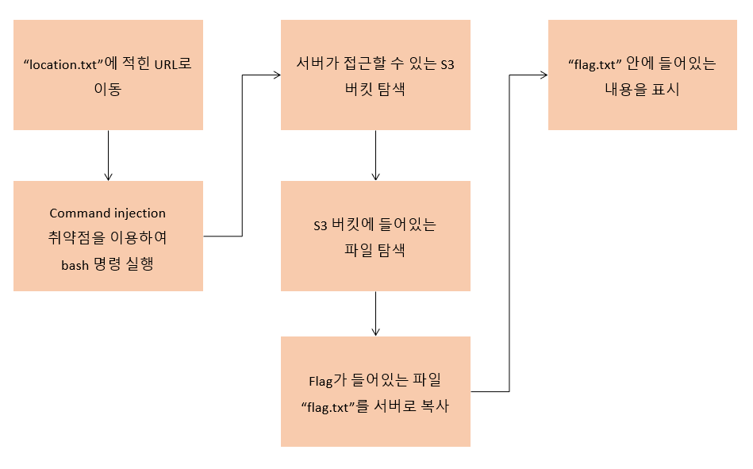

# Scenario: Command Injection

**Size:** Small

**Difficulty:** Easy

**Command:** `$ cd ./terraform; terraform init; terraform apply`

## Scenario Resources

* EC2 x 1
* S3 x 1

## Start of Scenario

- Public IP Address of an EC2 server which runs a web application
- `./terraform/location.txt`: contains Public IP Address above

## Scenario Goal(s)

Get `flag.txt` stored in single S3-Bucket

## Summary

You start as an outsider. Exploit web application vulnerable to command injection. Enumerate through S3 buckets to find and retrieve `flag.txt`.

## Exploitation Route(s)

## Route Walkthrough - Anonymous

1. You stumble upon a web application, which is vulnerable to command injection
2. Search AWS resources accessible by web application's hosting server.
3. Find a S3 bucket which contains single `txt` file.
4. Copy `txt` file to hosting server.
5. Use `cat` to see what is inside `txt` file.

A cheat sheet for this route is available [here](./cheatsheet.md).
